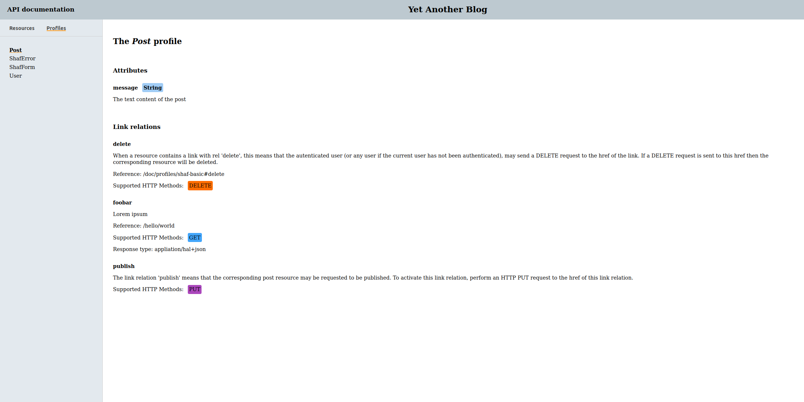
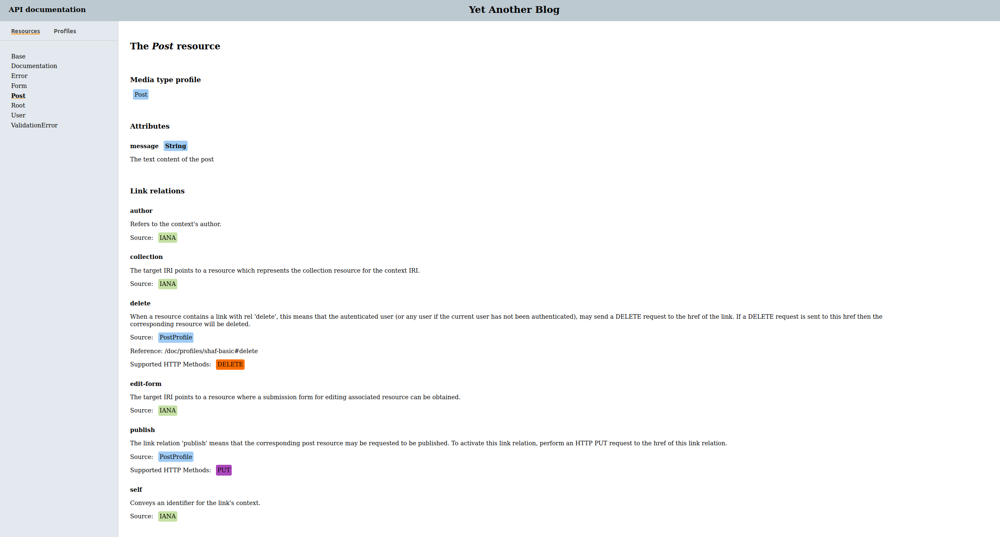

## API Documentation
The documentation for the API is generated from serializers (see [Serializers](SERIALIZERS.md)) and profiles (see [Profiles](PROFILES.md)) using the command `shaf generate documentation`.
The generator will output static html files in the public directory (configured in `Shaf::Settings.public_folder`, which defaults to `frontend/assets`).
To view the documentation, start the server and navigate the browser to `/api_doc/index.html`.
The documentation will list all resources (generated from serializers) and all profiles.
Both resources and profiles will look very similar and basically contain the same descriptions. The difference being that resources will show all links defined in the serializer regardless of them being present or not in the profile. Typically, they will contain link relations registered with [IANA](https://www.iana.org/assignments/link-relations/link-relations.xhtml) which may or may not be present in the profile. (Note: profiles might also define more attribute/link relations than the resource is making use of, as is  show with the `foobar` rel below).  
Consider the following profile and serializer:
```ruby
module Profiles
  class Post < Shaf::Profile
    name 'post'

    use :delete, from: Shaf::Profiles::ShafBasic

    attribute :message,
              type: String,
              doc: 'The text content of the post'

    relation :foobar,
             doc: 'Lorem ipsum',
             href: '/hello/world',
             content_type: 'appliation/hal+json'

    relation :publish,
             http_method: :put,
             doc: <<~DOC
               The link relation 'publish' means that the corresponding post resource
               may be requested to be published. To activate this link relation, perform
               an HTTP PUT request to the href of this link relation.
             DOC
  end
end

class PostSerializer < BaseSerializer

  model Post
  policy PostPolicy
  profile :post

  attribute :message

  link :self do
    post_uri(resource)
  end

  link :"edit-form" do
    edit_post_uri(resource)
  end

  link :delete, curie: :doc do
    post_uri(resource)
  end

  link :author do
    user_uri(resource.user_id)
  end

  link :publish do
    publish_post_uri(resource)
  end
end
```

They would produce the following documentation.  
Profile:

Resource:


