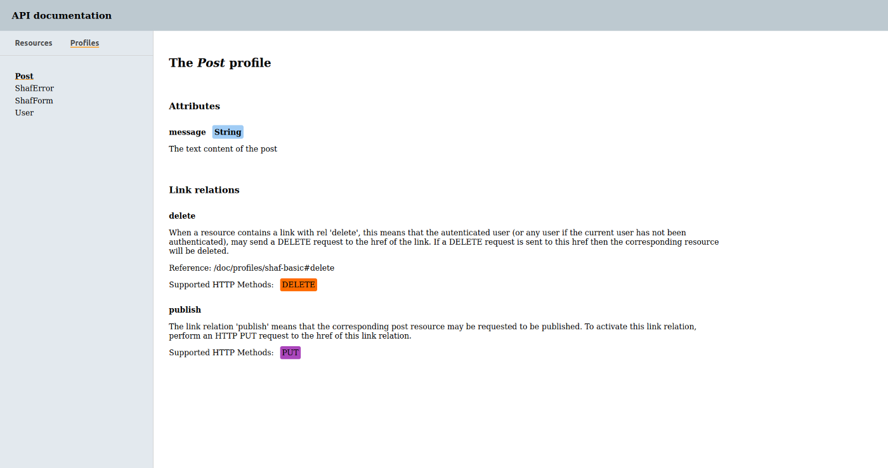

## Mediatype profiles
When choosing a mediatype, there are basically two approaches. Select (or invent) a mediatype that match all your requirements or select a generic mediatype that works on a broad range of use cases.
Shaf favors the use of HAL which is a generic mediatype that most certainly will be capable of rendering your resources. The advantage of using a generic (and well-know) mediatype is that it will be easy to find libraries that can serialize and deserialize payloads. The downside is that, even though clients can parse payloads, they wont necessarily understand what they mean.
This is were mediatype profiles comes into use. Profiles describe the attributes of a resource and what you can with it.
Note that mediatype profiles are agnostic to mediatypes, i.e we can use the same profile regardless if clients wants the response formatted as `application/hal+json` or `application/vnd.collection+json` etc.  
By inheriting from `Shaf::Profile` we get a DSL for creating mediatype profiles. These profiles can then be serialized into [ALPS](https://tools.ietf.org/html/draft-amundsen-richardson-foster-alps-04) and they are also used to generate human readable documentation. Classes inheriting from `Shaf::Profile` gets the following methods:
 - `::name(str)`  
   Sets the name of the profile. Must be called and `str` must be unique!
 - `::doc(str)`  
   Adds a top level documentation for the profile.
 - `::attribute(name, doc:, type: :string, &block)`  
   Adds an attribute descriptor. A block may be passed in to create nested attributes and relations.
 - `::rel(name, **options, &block)` (also aliased as `::relation(name, **options, &block)`.  
   Adds a link relation descriptor. Supported `options` are:
   - `doc` - The documentation/description of the link relation.
   - `href` - A resolvable href to another document that describes this link relation.
   - `http_method` (or `http_methods`) - An HTTP method (or a list of methods) that are supported for this link relation.
   - `content_type` - The format that is expected to be returned from this link relation. (Use with the _Accept_ header)
 - `::use(name, from:)`  
   Used for "including" a descriptor from another profile. `name` is the name of the descriptor and `from` specifies the Ruby class that defines the profile.
 - `::example`  
   TBD: This will be used to add examples of how the profile may be used. Currently this is not used yet, but hopefully this will change in the future.

#### What to specify
Ideally each attribute should be described with some text (`doc`) and its type. Link relations should either specify a `href` which will be used as the full description for the corresponding link relation. Or they should be described with some text (`doc`) and HTTP method(s). If it's important that clients specify the correct value in the _Accept_ header, then `content_type` should be specified.  
Link relations only need to be specified if they are not already registered with [IANA](https://www.iana.org/assignments/link-relations/link-relations.xhtml) (clients are assumed to be aware about link relations registered with IANA). Though it's perfectly fine to describe link relations in IANA and supply a description that better suites your API (your links should not conflict with the IANA registry, but perhaps you could write the documentation in a way that matches your API better, or perhaps you need to specify the HTTP methods that are supported by your API).

#### An example
```ruby
module Profiles
  class Post < Shaf::Profile
    name 'post'

    use :delete, from: Shaf::Profiles::ShafBasic

    attribute :message,
              type: String,
              doc: 'The text content of the post'

    rel :publish,
        http_method: :put,
        doc: <<~DOC
          The link relation 'publish' means that the corresponding post resource
          may be requested to be published. To activate this link relation, perform
          an HTTP PUT request to the href of this link relation.
        DOC
  end
end
```

The profile above defines the `message` attribute and two link relations - `delete` which is defined in `Shaf::Profiles::ShafBasic` and `publish`. Serialized as `application/alps+json` this profile looks like:
```json
{
  "alps": {
    "version": "1.0",
    "descriptor": [
      {
        "id": "message",
        "type": "semantic",
        "doc": {
          "value": "The text content of the post"
        },
        "name": "message"
      },
      {
        "id": "delete",
        "type": "idempotent",
        "href": "/doc/profiles/shaf-basic#delete",
        "doc": {
          "value": "When a resource contains a link with rel 'delete', this\nmeans that the autenticated user (or any user if the\ncurrent user has not been authenticated), may send a\nDELETE request to the href of the link.\nIf a DELETE request is sent to this href then the corresponding\nresource will be deleted.\n"
        },
        "name": "delete",
        "ext": [
          {
            "id": "http_method",
            "href": "https://gist.github.com/sammyhenningsson/2103d839eb79a7baf8854bfb96bda7ae",
            "value": [
              "DELETE"
            ]
          }
        ]
      },
      {
        "id": "publish",
        "type": "idempotent",
        "doc": {
          "value": "The link relation 'publish' means that the corresponding post resource\nmay be requested to be published. To activate this link relation, perform\nan HTTP PUT request to the href of this link relation.\n"
        },
        "name": "publish",
        "ext": [
          {
            "id": "http_method",
            "href": "https://gist.github.com/sammyhenningsson/2103d839eb79a7baf8854bfb96bda7ae",
            "value": [
              "PUT"
            ]
          }
        ]
      }
    ]
  }
}
```
Note: ALPS is not specific for HTTP and doesn't have native support for specifying HTTP methods. Thus, the _http_method_ extension is used so that we can specify the available HTTP methods.

The ALPS response is mostly served as machine readble documentation. If we generate api documentation (see [Documentation](DOCUMENTATION.md)), then we get the human friendly version which looks like this:  

